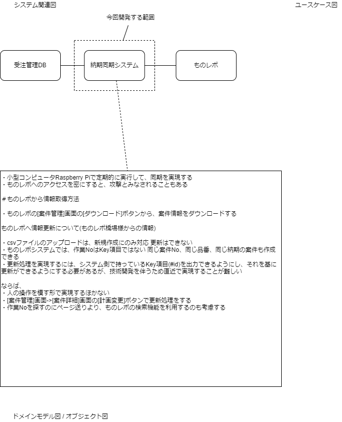

# SynchronizeMono-revoDeliveryDates
ものレボの納期を同期させる

## 技術資料


### 規約
[他言語プログラマが最低限、気にすべきGoのネーミングルール](https://zenn.dev/keitakn/articles/go-naming-rules)
[Go の命名規則](https://micnncim.com/posts/ja/go-naming-convention)

### 開発環境インストール
vscodeは入っている前提で説明する。

こちらを参考に、拡張機能をインストールして、設定を行う。
[VSCodeでGo言語の開発環境を構築する](https://qiita.com/melty_go/items/c977ba594efcffc8b567)

さらに読み進めてプロジェクトのセットアップを行う。
もしくは、gitからダウンロードする。

launch.jsonを記述する。
```json
{
    // IntelliSense を使用して利用可能な属性を学べます。
    // 既存の属性の説明をホバーして表示します。
    // 詳細情報は次を確認してください: https://go.microsoft.com/fwlink/?linkid=830387
    "version": "0.2.0",
    "configurations": [
        {
            "name": "Launch Workspace",
            "type": "go",
            "request": "launch",
            "mode": "auto",
            "program": "${workspaceFolder}"
        },
        {
            "name": "Launch File",
            "type": "go",
            "request": "launch",
            "mode": "auto",
            "program": "${fileDirname}"
        }

    ]
}
```

### 必要ライブラリ

#### DIツール
[Goでwireを使って依存性注入（DI）する](https://rinoguchi.net/2022/06/go_wire_id.html)
[GoのDIツールwireで知っておくと良いこと](https://christina04.hatenablog.com/entry/google-wire)
[GoのプロジェクトのDIをWireを使ってシンプルに](https://qiita.com/momotaro98/items/0b75a37048833dd6d324)
```
$ go install github.com/google/wire/cmd/wire@latest
```
#### 環境変数
[【Go】.envファイルをGolangでも使用するためのライブラリ「godotenv」](https://qiita.com/sola-msr/items/fb7d6889d7bd7a6705d0)
```
$ go get -u github.com/joho/godotenv
```
#### ロギング
[golangの高速な構造化ログライブラリ「zap」の使い方](https://qiita.com/emonuh/items/28dbee9bf2fe51d28153)
```
$ go get -u go.uber.org/zap
```
#### スクレイピング
[golangでagoutiとgoqueryを使ってスクレイピングする](https://qiita.com/york_____nishi/items/b76ff9163afaaad13de2)
goquery
```
$ go get -u github.com/PuerkitoBio/goquery
```
#### ブラウザ自動操作
chromium driver
[Go×agoutiで病院の予約戦争に勝利する](https://tanabebe.hatenablog.com/entry/2019/12/24/180000)
frame対策:[阿部寛をWebDriverでいじくる](https://qiita.com/h-hiroki/items/04d8c6636968c07a438e)
[Goではじめてみたブラウザの自動操作](https://qiita.com/0829/items/c1e494bb128ade5f0872)
[Python Webスクレイピング テクニック集「取得できない値は無い」JavaScript対応@追記あり6/12](https://qiita.com/Azunyan1111/items/b161b998790b1db2ff7a)
```
$ go get -u github.com/sclevine/agouti
```
#### モック
[Goでメソッドを簡単にモック化する【gomock】](https://qiita.com/gold-kou/items/81562f9142323b364a60)
参考:[Goのテストに使える手作りモックパターン](https://moneyforward.com/engineers_blog/2021/03/08/go-test-mock/#fnref:1)
```
$ go get github.com/golang/mock/gomock
$ go install github.com/golang/mock/mockgen
```
#### アサーション
testify
標準パッケージのtestingにはassert関数はありません。
testifyライブラリーを使用することで、assert関数を使うことができます。
[Golangのtestify/assert 使えそうな関数まとめ](https://qiita.com/JpnLavender/items/21b4574a7513472903ea)
```
$ go get -u -v github.com/stretchr/testify
```
#### ORマッパー
gorm
Go言語のORMライブラリ
[GORMガイド](https://gorm.io/ja_JP/docs/index.html)
[GORMガイド:データベースに接続する(SQLServer)](https://gorm.io/ja_JP/docs/connecting_to_the_database.html#SQL-Server)
[【Go】Gormの使い方(CRUD)](https://zenn.dev/a_ichi1/articles/4b113d4c46857a)
[GORMガイド:モデルを宣言する](https://gorm.io/ja_JP/docs/models.html)
[GORM による Model (Entity) の設計](https://zenn.dev/spiegel/books/a-study-in-postgresql/viewer/models-with-gorm)
```
$ go get -u gorm.io/gorm
# go get -u gorm.io/driver/sqlserver
```
