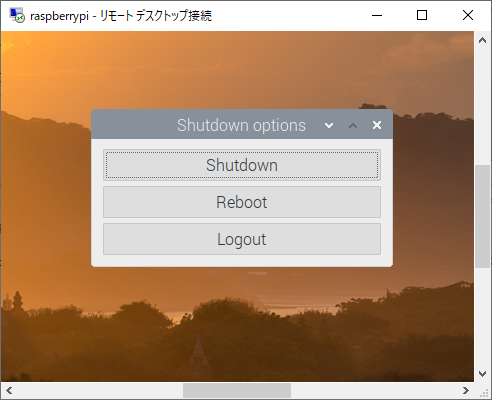

# SynchronizeMono-revoDeliveryDates
## 概要
受注管理DBと、ものレボの納期を同期させます。

## 動作環境
Raspberry piで実行します。

### Raspberry pi
名刺サイズの小型コンピュータの事で、LinuxOSが動作します。
常時起動性・定期実効性に優れています。

## ファイル
|ファイル名|説明|
|--|--|
|app_log.json|動作ログ|
|appsettings.json|アプリ動作設定|
|reportsettings.json|結果メール設定|
|SynchronizeMonorevoDeliveryDates|アプリ本体|
|download/work|作業フォルダ|

運用するうえで、編集する必要があるのは、reportsettings.jsonです。

## 結果メール設定ファイル編集

1. Windowsで、次のフォルダを開きます。
\\raspberrypi\seikan\bin\JSONedit_0_10_0_4

1. JSONedit.exeをダブルクリックして実行します。

1. メニューから、File > Openをクリックして、reportsettings.jsonを開きます。
\\raspberrypi\seikan\bin\SynchronizeMonorevoDeliveryDates\reportsettings.json

### 送信者・返信先の設定
左側のツリーを広げると、下表の様な階層が確認できます。
このうち、"senderAddress"と"replyToAddress"が送信者・返信先の設定です。
|Level-1|Level-2|説明|
|--|--|--|
|senderAddress||送信者の設定項目|
|senderAddress|email|送信者のメールアドレス|
|senderAddress|name|送信者の名前|
|replyToAddress||返信先の設定項目|
|replyToAddress|email|返信先のメールアドレス|
|replyToAddress|name|返信先の名前|
"email"・"name"のいずれかを選択して、下図右側の矢印部分を編集します。

**注意:** Level-1/2の名称は変更しないでください。
アプリが動作しなくなります。
変更して良いのは、設定値(Value)のみです。

### 宛先(TO)・CC・BCCの設定
基本的には、送信者と同じ形式をしています。
宛先(TO)・CC・BCCは、複数設定できる事から、角カッコで、複数のメールアドレスを表現しています。

#### 宛先追加
宛先を追加するには、既存のメールアドレスをコピーするのが簡単です。
図のように操作してください。
その後、メールアドレスと名前を編集します。
"recipientAddresses"の角カッコを、"ccAddresses"・"bccAddresses"へ貼りつける事もできます。

#### 宛先削除
角カッコを選択後、Deleteキーを押します。

### 表題の設定
表題を編集するには、"subject"を選択し、下図右側のValueを編集します。
"%count%"は、アプリ内で、納期の変更対象の件数に置換されます。

### 接頭辞・接尾辞の設定
同期レポート本文の、冒頭と末尾にそれぞれ挿入されます。
編集の方法は表題と同じです。
"%count%"を入力すると、表題と同様に置換されます。
|項目|説明|解説|
|--|--|--|
|prefixReport|接頭辞|冒頭に挿入されます|
|suffixReport|接尾辞|末尾に挿入されます|

## 実行スケジュール
毎日午前7時に、納期の同期を行い、結果をメール送信します。
スケジュールの変更は、リモートデスクトップで小型コンピュータにログインして行います。

### リモートデスクトップ
1. リモートデスクトップは、スタートメニューから、Windowsアクセサリにあります。

1. コンピュータ名に「raspberrypi」を入力します。
1. 「接続」ボタンを押します。

1. 「Session」は変更しないでください。
1. 「username」「password」両方に、「seikan」と入力してください。
1. 「OK」ボタンを押します。

### リモートデスクトップの終了
1. リモートデスクトップを終了するときは、左上のアイコンから、「ログアウト」を押します。

1. シャットダウンウィンドウから、「Logout」を押します。
通常は、「Logout」を押しますが、シャットダウンや再起動をしたいときは、「Shutdon」「Reboot」のいずれかを押します。

**注意** このコンピュータを移動する際に、電源を抜く際は、シャットダウンを行ってください。
Linuxサーバが壊れてしまうことがあります。
また、電気工事など停電時は、シャットダウンをしてください。

### 実行スケジュール設定
1. 左上のアイコンをクリックして、「タスクスケジューラー」を起動します。

1. 一つだけタスクが登録されています。
この例では、毎日午前7時に設定してあります。

1. 変更する場合は、「編集」ボタンを押します。
1. この画面で、いつタスクを実行するのか設定します。

1. 設定が終わったら、「OK」ボタンを押します。
